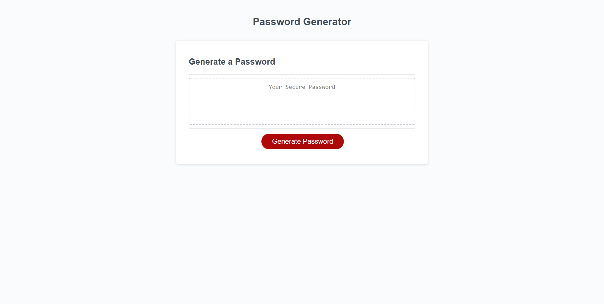

# PasswordGen Description
    
    This project's goal is to fill in the remaining code to create a functioning password generator. So this will be a list of all of the things I add to the code.

        -   I added a function using the variable generatePassword to create a prompt. after you push the generate password button on the webpage. This prompt is used to ask the user how many characters they want in their password which has to be 8-128. I also made it so if they dont choose a number or if they choose a number outside of 8-128 that it will give them an alert. It will also stop the continuation of the code and prompts so they can try again at that same prompt or choose to exit it.

        -   I added confirm prompts so the user can choose if they want lowercase, uppercase, numbers, and or symbols to be included in their password. I made a variable string for lowercase, uppercase, numbers, and symbols containing all of the acceptable characters for each that can be inputed into the password. Then I used 'if" to make it so that whatever the user selects during the prompts is what gets pushed into the password generation.

        -   I added functions and a "for" line to allow the password generator to randomly select characters based on the selected character amount and the selected allowed types of characters the user selected to create a fully randomized password.

        -   Finally, I added comments to the css and javascript explaing what the code does and what code affects what on the webpage and within the webpage for its functionality.

## Project Screenshot

### Github Deployed Link

https://kjkhalil.github.io/PasswordGen/